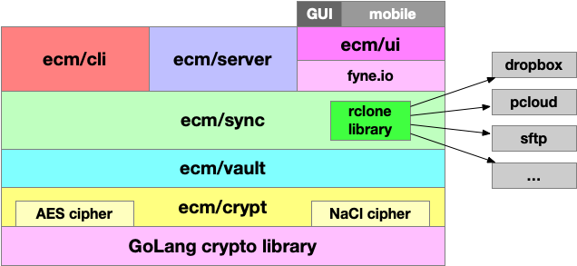

## Encrypted Content Management

Encrypted Content Management (ECM) is a generic toolkit for encrypting any kind
of digital content (files, passwords, notes, etc.). It can be viewed as
alternative to password managers similar to 1Password, LastPass, ButterCup,
etc. but it is not restricted to secure only the meta-data. Any content can be
encrypted with ECM.

ECM fills the gap among different solutions and provide CLI, Web server, browser extension and UI
based on GoLang crypto library. It depends on [rclone](https://rclone.org/)
library to provide sync capabilities to various cloud providers (such as
Dropbox, PCloud, etc.) as well as syncing to specific hosts (via sftp
protocol). All components of ECM toolkit are written in Go, and therefore
are portable across different architectures and hardwares. The CLI interface
allows to work with ECM from a terminal, and therefore portable across
hosts. The web server (and wasm extention) provides fully featured
web server with 2fa authentication. Finally, thanks to [fyne.io](https://fyne.io/)
library the UI provides consistent interface among platform and mobile devices.

### Motivation
We start this project after many years of experience with 1Password solution.
Originally, there were few missing pieces with 1Password such as:
- command line interace (provided in version 8)
- web server (there is no publicly available server so far)
- support of multiple cloud providers and usage of on/off-site premises
But more importantly, the 1Password has changed their license based approach
to subscription model. Even though it is profiable for tha company we
considered that over the time it is not valuable solution. Despite monthly
fee the 1Password does not provide ability to use own infrastructure, lack
of support for different cloud storage providers and closed model of their
solution. All of these factors lead to seek alternative solutions and idea
of implementing password manager with larger scope came up once we discovered
that Go application now have native GUI (via [fyne.io](https://fyne.io/))
and ability to run code on moble platform, e.g.
[gomobile](https://pkg.go.dev/golang.org/x/mobile/cmd/gomobile).
Moreover, the support for various architectures, such as AMD, ARM, Power8, and
[WebAssembly](https://www.wikiwand.com/en/WebAssembly) leads us to Go-based
implementation of encryption toolkit.

### Architectore
Below you can find current architecture of ECM toolkit:

The ECM toolkit has the following list of requirements:
- OS and architecture agnostic
- support different environments, work as CLI tool, provide HTTP service, etc.
- support multiple cipher's implementation (currently supports AES and NaCl)
- support flexible data formats, e.g. pre-defined Login/Password records,
  or notes, or event entire files
- support multiple vaults
- support multiple storage systems, e.g. local FS, various cloud platforms,
remote storage, storage on remote nodes, etc.
- easy customization including vaults location, transfer, synchronisaions,
and record attributes, etc.

This work is in progress and can only be viewed as pre-alpha release.

### Current functionality
So far, the ECM toolkit works as a CLI and web service. It supports different ciphers (AES and
NaCl are implemented). It allows to add login records, as well as user-based
meta-data, it also allow to add any kind of file to the vault.
It provides basic search capabilities based on regpex matching, record editing, etc.
Since vault resides in specific directory, and records stored in
individual encrypted files, the sync procedure with any destination is very
simple and can be organized via `rsync` tool.

### Implementations
- [crypt](crypt/README.md) library used by ECM
- [vault](vault/README.md) library used by ECM
- [cli](cli/README.md) interface for ECM
- [server](server/README.md) implementation of ECM
- [term](term/README.md) based implementation of ECM
- [ui](ui/README.md) implementation of ECM
- [wasm](wasm/README.md) implementation of ECM
