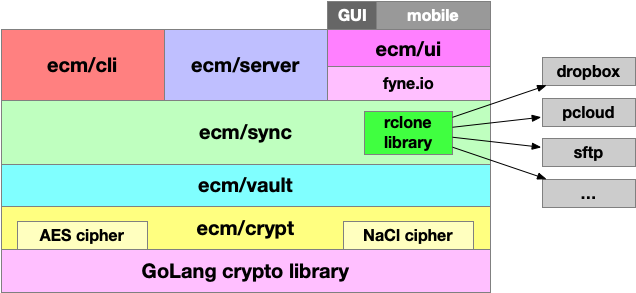

## ECM architecture

ECM architecture has the following structure:

At the core the content is encrypted using Go standard library
and stored on your file system as encrypted files. These files
can be safely be transported by any protocol without additional
encryption (but of course you can add an additional encrypted
transfer protocol, e.g. HTTPs).

The [crypt](https://github.com/vkuznet/ecm/blob/main/crypt/crypt.go)
module provides implementation of different ciphers. Currently
we support encryption using
[AES](https://www.wikiwand.com/en/Advanced_Encryption_Standard)
and
[NaCl]((https://nacl.cr.yp.to/index.html)) ciphers.

The [Vault](https://github.com/vkuznet/ecm/blob/main/vault/) module
is just a wrapper around file system to organize your
encrypted files into vault records. Its APIs allows to read
and encrypte/decrypt existing files.

The [sync](https://github.com/vkuznet/ecm/blob/main/sync/) module
provides ability to sync encrypted files among different
provides. Here we rely on [rclone](github.com/rclone) library
which provides support for variety of cloud providers. So far
we enabled [dropbox](github.com/rclone/rclone/backend/dropbox),
[local](github.com/rclone/rclone/backend/local),
[pcloud](github.com/rclone/rclone/backend/pcloud) and
[sftp](github.com/rclone/rclone/backend/sftp)
backends. And, dropbox backend is used in ECM Native UI application.

The [cli](https://github.com/vkuznet/ecm/blob/main/cli/) module
provides command line implementation.

The [server](https://github.com/vkuznet/ecm/blob/main/server/) module
provides web server which includes:
- Let's Encrypt support to setup encrypted server on your infrastructure
- it supports captcha
- it supports 2fa authentication
etc.

The [ui](https://github.com/vkuznet/ecm/blob/main/ui/) module
provides ECM Native UI application based on [fyne.io](https://fyne.io/)
framework. This UI provides identical look-and-feel across multiple
platforms, e.g. Linux, Windoes, macOS and mobile.

And, [wasm](https://github.com/vkuznet/ecm/blob/main/wasm) module
implements WebAssembly extension which can be used in browsers.
So far we implented and tested only Chrome based extention.
