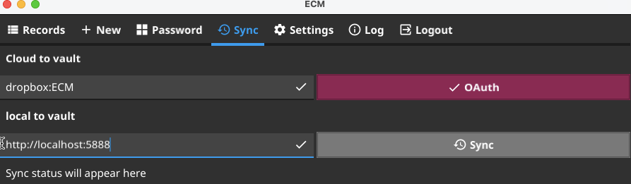

### ECM sync approach
The ECM model (based on encrypted files) allows the use of almost any syncing solutions. For instance, if you work on your laptop you may sync your vault to any cloud storage, e.g. Dropbox or PCloud, and ECM built-in usage of [rclone](https://rclone.org/) will allow you to sync files among your tools, e.g. sync files from Dropbox to your mobile phone. Said that, the ECM provides a web server which you may deploy at your premises, e.g. on LAN or WAN, on your laptop, router or remote VirtualMachine, on cloud provider infrastructure or any cluster. And, usage of HTTP protocol will allow you to use web server REST API to fetch or upload your encrypted content to your web server.

### Sync procedure using cloud based provider
There are many cloud based providers which you can use to store your data, e.g.Dropbox or pCloud. Luckily, ECM provides excellent support to sync your data from cloud based providers back to your app.
But first we will discuss how to put your data to the cloud provider. There are many ways to do it, e.g. from simple copy procedure to more sophisticated `rsync` tools under UNIX based systems.
Since ECM stores its data in individual encrypted files you can safely copy it to your favorite cloud based provider, e.g. to Dropbox. For instance, you may install a Dropbox app and use your favorite copy approach to copy your files, e.g. using GUI or CLI interfaces.
Once data is on a cloud we will show here how to sync it to your app, e.g. mobile phone.

### Sync via SFTP
The [rclone](https://rclone.org/) provides ability to sync data over sftp
protocol. To enable it please locate your app `rclone.conf` file:
```
./ecm -prefs
/some/path/it/will/print
```
and over there you'll find your `rclone.conf` file. Just add to it the
following section:
```
[sftp]
type = sftp
host = YOUR_HOST_NAME
user = YOUR_USER_NAME
pubkey_file = /YOUR_PATH/.ssh/id_ecdsa.pub
privatekey_file = /YOUR_PATH/.ssh/id_ecdsa
md5sum_command = md5 -r
sha1sum_command = none
shell_type = unix
```
Please replace parts started with `YOUR` to your values. You will also need to
generate proper `id_ecdsa` files as following:
```
ssh-keygen -t ECDSA
```
and place your ecdsa public file to your host. Fore more information you
may search on google how to do it or look at this
[manual](https://linuxhint.com/generate-ssh-keys-on-linux/).

Then, test your ssh connection with your ecdsa key to ensure that you
can access remote host.

After these steps you may use your sftp method in ECM app. Just visit
settings page and enter into your `local|http|sftp` field:
```
sftp:/path/to/ECM
```
Where `/path/to/ECM` is a path to your ECM area which will be used for sync'ing
records to your app.


### Sync procedure using Local HTTP server
To perform sync of your ECM application, e.g. mobile phone or native macOS app, with local HTTP server we need to start HTTP server elsewhere, e.g. on a localhost.
This can be done as following:
```
# login to your machine and run
./ecm -config server_config.json

# verify that you can connect to your server by using curl
curl "http://localhost:5888/vault/Primary/records?id=true" | jq
```
Now, switch to your ECM application and provide proper input to your local URI
, then adjust the sync URI to
`http://localhost:5888` (the default host:port of your server) and click Sync,
e.g.

