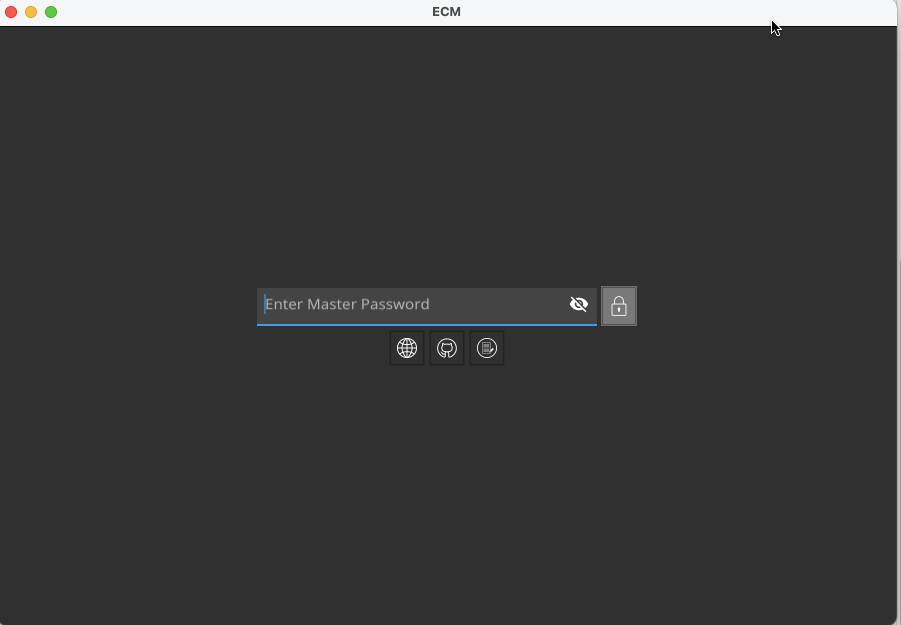
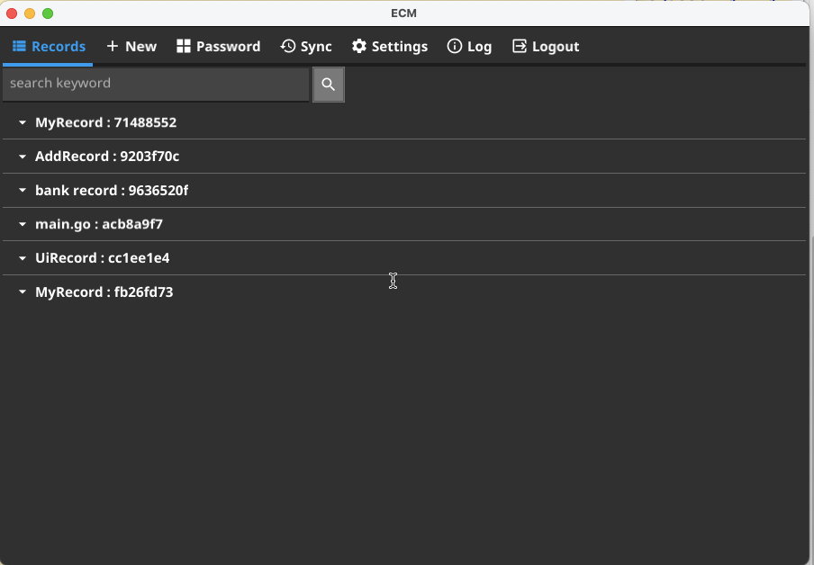
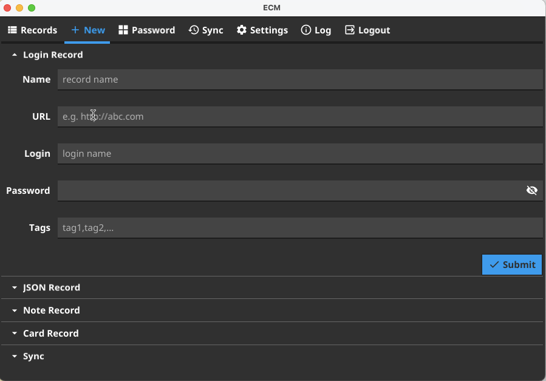
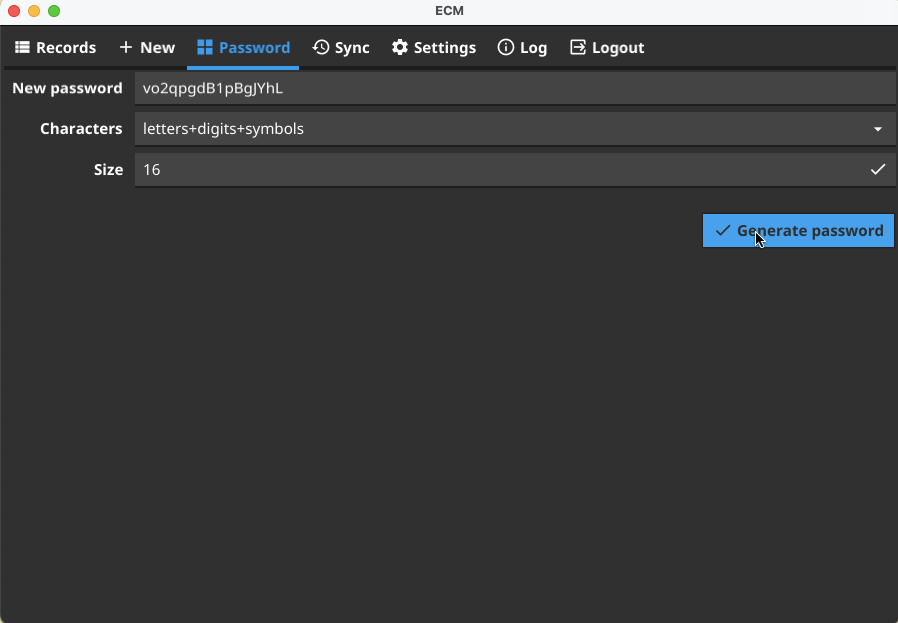
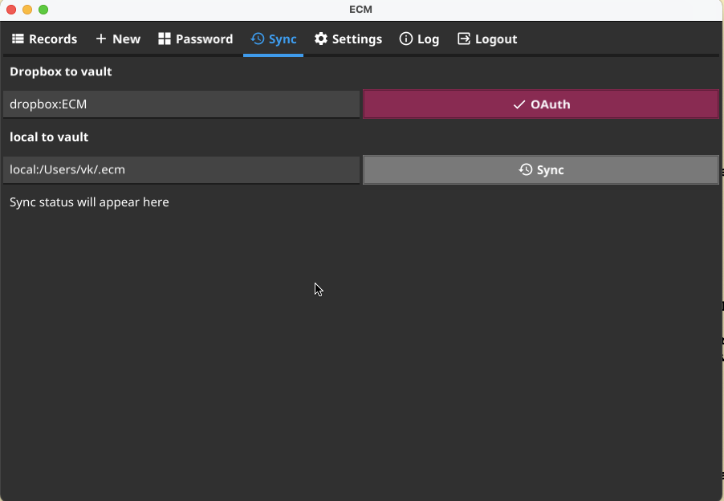
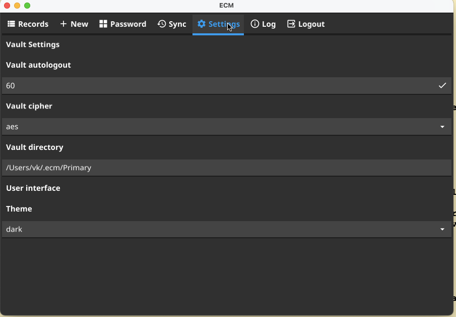
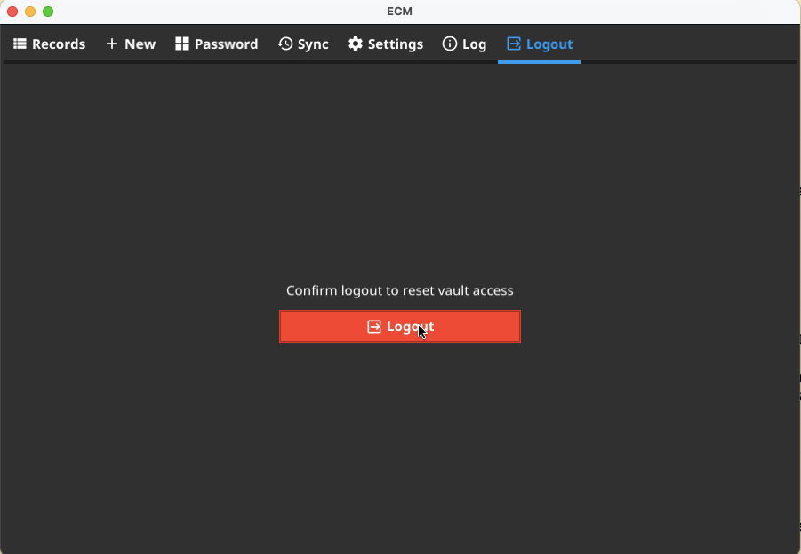

### ECM tools
The ECM toolkit provides a different set of tools. Please refer to the appropriate section below to your favorite area.
#### ECM Command Line Interface (CLI)
This ECM cli tool provide convenient Command Line Interface which works identically across many different operating systems, e.g. Linux, OSX, Windows, etc. You can either download the `ecm` cli tool from a release area or compile it using the following steps:
```
git clone git@github.com:vkuznet/ecm.git
cd ecm/cli
make
```
##### How to use it
```
# get help
./ecm -help
Usage of ./ecm:
  -cipher string
    	cipher to use (aes, nacl)
  -decrypt string
    	decrypt given file to stdout
  -edit string
    	edit record with given ID
  -encrypt string
    	encrypt given file and place it into vault
  -examples
    	show examples
  -export string
    	export vault records to given file (ECM JSON native format)
  -import string
    	import records from a given file. Support: CSV, JSON, or ecm.json (native format)
  -info
    	show vault info
  -lock int
    	lock interval in seconds (default 60)
  -pat string
    	search pattern in vault records
  -pcopy string
    	extract given attribute from the record and copy to clipboard
  -recreate
    	recreate vault and its records with new password/cipher
  -rid string
    	show record with given ID and copy its password to clipboard
  -vault string
    	vault name
  -verbose int
    	verbose level
  -version
    	show version

# show examples
./ecm -examples

# list all vault records
./ecm
Enter vault secret:

------------
ID:		    6b346bbd-a8a5-4af8-b9c6-c308c42bcd86
Name:		Record
Login:		test
Password:	************
URL:
Tags:
Note:

# show individual record
./ecm -rid fb26fd73-ea17-49f5-b38b-cf17575f1264

# edit individual record
./ecm -edit fb26fd73-ea17-49f5-b38b-cf17575f1264

# recreate (re-encrypt) vault
./ecm -recreate

# import 1Password records and export them to records.json (ECM JSON data-format)
# at this point you can edit records.json in your favorite editor
./ecm -import 1password.csv -export ./records.json

# import ECM JSON to the vault (ecm.json must be used and it
# should contain ECM JSON data-format)
./ecm -import ecm.json

# encrypt given file and store it into the vault
./ecm -encrypt myfile.txt

# show vault info
./ecm -info
Enter vault secret:
vault /Users/vk/.ecm/Primary
Last modified: 2022-05-22 10:23:15.381822738 -0400 EDT
Size 288 (288.0B), mode drwxr-xr-x
6 records, encrypted with aes cipher

# decrypt given vault record
./ecm -decrypt ~/.ecm/Primary/2dface67-e5a8-44f7-ad58-adfa0f54b954.aes
```
Here is a typical structure of `ecm` vault(s):
```
tree ~/.ecm
/Users/users/.ecm
├── Primary
│   ├── 6b346bbd-a8a5-4af8-b9c6-c308c42bcd86.aes
│   ├── 71488552-1023-4480-9aa4-a909b23726ee.aes
│   ├── 9636520f-63ad-478c-92f7-3ed3b4eb579f.aes
│   ├── acb8a9f7-6140-42d2-bb32-f730f7ab572f.aes
│   ├── backups
│   │   ├── 6b346bbd-a8a5-4af8-b9c6-c308c42bcd86.aes-2021-08-30T18:02:56-04:00
│   │   ├── 6b346bbd-a8a5-4af8-b9c6-c308c42bcd86.aes-2021-08-30T18:03:10-04:00
│   └── fb26fd73-ea17-49f5-b38b-cf17575f1264.aes
....
```

#### UI tool
The `ecm` UI application can be downloaded from a release area or build as following:
```
git clone git@github.com:vkuznet/ecm.git
cd ecm/ui
make
```
In order to use it just start `ecm` executable. Below we show few screen shots of `ecm` application.









#### WASM browser extension
#### WebServer
